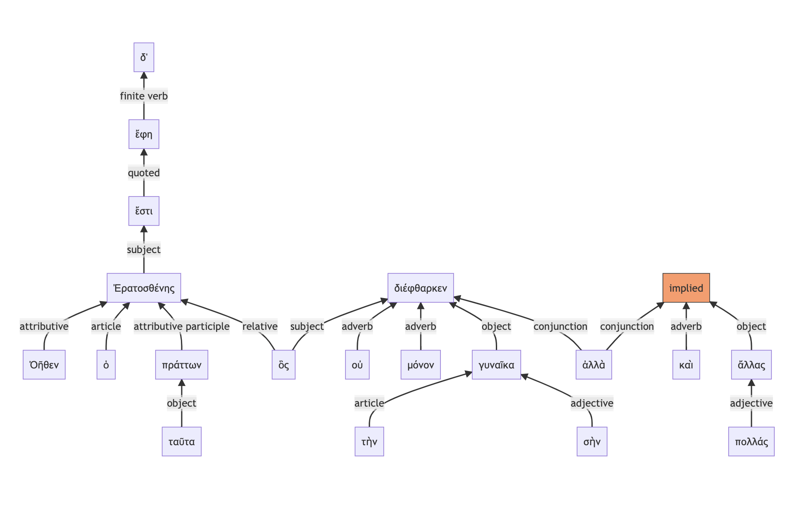
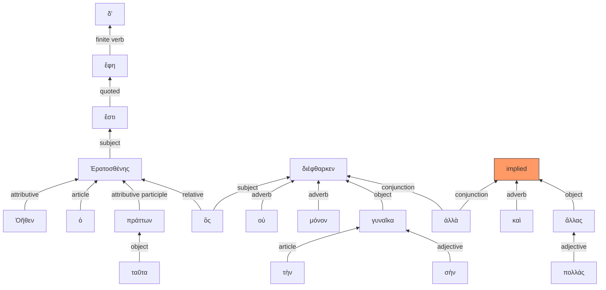

# Visualizations: example 2

> ἔστι δ’ ἔφη Ἐρατοσθένης Ὀῆθεν ὁ ταῦτα πράττων, ὃς οὐ μόνον τὴν σὴν γυναῖκα διέφθαρκεν ἀλλὰ καὶ ἄλλας πολλάς:

### Clustered in verbal units

Clustered in verbal units indented by level of subordination:

> **Level 1** (main clause)
>
>> **Level 2** (one level of subordination)
>
>>> **Level 3*** (two levels of subordination)
>
>> ἔστι Ἐρατοσθένης Ὀῆθεν
>
> δ’ ἔφη
>
>>> ὁ ταῦτα πράττων
>
>>> ὃς οὐ μόνον τὴν σὴν γυναῖκα διέφθαρκεν
>
>>> ἀλλὰ καὶ ἄλλας πολλάς:

### Tokens in document order

> **Level 1** (main clause)
>
>> **Level 2** (one level of subordination)
>
>>> **Level 3** (two levels of subordination)
>
>> ἔστι
>
> δ’ ἔφη
>
>> Ἐρατοσθένης Ὀῆθεν
>
>>> ὁ ταῦτα πράττων
>
>>> ὃς οὐ μόνον τὴν σὴν γυναῖκα διέφθαρκεν
>
>>> ἀλλὰ καὶ ἄλλας πολλάς:

---

### Syntax graph

