```mermaid
graph BT;


5142028[ἔφη] --> |finite verb| 5142027[δ'];


5142026[ἔστι] --> |quoted| 5142028[ἔφη];
5142029[Ἐρατοσθένης] --> |subject| 5142026[ἔστι];

5142030[Ὀῆθεν] --> |attributive| 5142029[Ἐρατοσθένης];
5142031[ὁ] --> |article| 5142029[Ἐρατοσθένης];

5142033[πράττων] --> |attributive participle| 5142029[Ἐρατοσθένης];
5142032[ταῦτα] --> |object| 5142033[πράττων] ;

5142035[ὃς] --> |relative| 5142029[Ἐρατοσθένης];
5142040[γυναῖκα] --> |object| 5142041[διέφθαρκεν];
5142035[ὃς] -->  |subject| 5142041[διέφθαρκεν];
5142036[οὐ] --> |adverb| 5142041[διέφθαρκεν];
5142037[μόνον] --> |adverb| 5142041[διέφθαρκεν];
5142038[τὴν] --> |article| 5142040[γυναῖκα];
5142039[σὴν] --> |adjective| 5142040[γυναῖκα];


5142042[ἀλλὰ] --> |conjunction| 5142041[διέφθαρκεν];

5142042[ἀλλὰ] --> |conjunction| 5142041bis[implied];

5142044[ἄλλας] --> |object| 5142041bis[implied];
5142045[πολλάς] --> |adjective| 5142044[ἄλλας];
5142043[καὶ] --> |adverb| 5142041bis[implied];

class 5142041bis implicit;
classDef implicit fill:#f96,stroke:#333;
```

# Visualization

## Example 1

Here are examples of visualizations of the following passage of Lysias 1:

> ἐπειδὴ δέ μοι ἡ μήτηρ ἐτελεύτησε, πάντων τῶν κακῶν ἀποθανοῦσα αἰτία μοι γεγένηται

### Clustered in verbal units

Clustered in verbal units indented by level of subordination:

> **Level 1** (main clause)
>
>> **Level 2** (one level of subordination)
>
>> `unit 1` ἐπειδὴ δέ μοι ἡ μήτηρ ἐτελεύτησε,
>
> `unit 2` πάντων τῶν κακῶν αἰτία μοι γεγένηται.
>
>> `unit 3` ἀποθανοῦσα

### Tokens in document order

All tokens displayed in document order at level of subordination:

> **Level 1** (main clause)
>
>> **Level 2** (one level of subordination)
>
>
>> ἐπειδὴ δέ μοι ἡ μήτηρ ἐτελεύτησε,
>
>  πάντων τῶν κακῶν 
>
>> ἀποθανοῦσα
>
> αἰτία μοι γεγένηται.
 

### Syntax graph

Generated from this mermaid source:

## Another example

> ἔστι δ’ ἔφη Ἐρατοσθένης Ὀῆθεν ὁ ταῦτα πράττων , ὃς οὐ μόνον τὴν σὴν γυναῖκα διέφθαρκεν ἀλλὰ καὶ ἄλλας πολλάς :

### Clustered in verbal units

Clustered in verbal units indented by level of subordination:

> **Level 1** (main clause)
>
>> **Level 2** (one level of subordination)
>
>>> **Level 3*** (two levels of subordination)
>
>> ἔστι Ἐρατοσθένης Ὀῆθεν
>
> δ’ ἔφη
>
>>> ὁ ταῦτα πράττων
>
>>> ὃς οὐ μόνον τὴν σὴν γυναῖκα διέφθαρκεν
>
>>> ἀλλὰ καὶ ἄλλας πολλάς:

### Tokens in document order

> **Level 1** (main clause)
>
>> **Level 2** (one level of subordination)
>
>>> **Level 3** (two levels of subordination)
>
>> ἔστι
>
> δ’ ἔφη
>
>> Ἐρατοσθένης Ὀῆθεν
>
>>> ὁ ταῦτα πράττων
>
>>> ὃς οὐ μόνον τὴν σὴν γυναῖκα διέφθαρκεν
>
>>> ἀλλὰ καὶ ἄλλας πολλάς:

---

### Syntax graph

